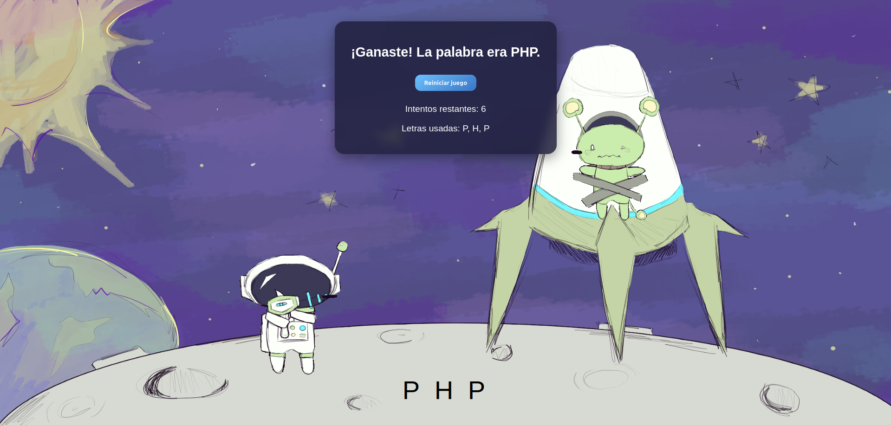
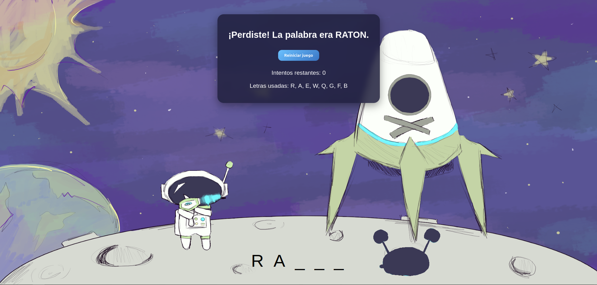

# 🪐 Ahorcado Espacial

<p align="center">
  <!---->
  
</p>

> **¡Sobrevive en el espacio! Cada fallo hará que el astronauta desintegre al alien.**  

---

## 📋 Índice  

1. [🔍 Descripción general](#descripción-general)  
2. [✨ Características](#características)  
3. [🛠️ Tecnologías utilizadas](#tecnologías-utilizadas)  
4. [ℹ️ Información adicional](#información-adicional)  
   4.1. [🚀 Mejoras planeadas](#mejoras-planeadas)  
   4.2. [⚙️ Desafíos técnicos](#desafíos-técnicos)  
   4.3. [📚 Lecciones aprendidas](#lecciones-aprendidas)  
5. [💻 Requisitos del sistema](#requisitos-del-sistema)  
6. [🚧 Guía de instalación](#guía-de-instalación)  
7. [📖 Manual de usuario](#manual-de-usuario)  
8. [🤝 Contribuciones](#contribuciones)  
9. [📝 Licencia](#licencia)  

---

## 🔍 Descripción general  

Ahorcado con temática espacial, donde cada error del jugador hace que el astronauta dispare al alienígena y se vaya desintegrando visualmente.  
Las palabras se cargan desde un fichero `.txt`, sin necesidad de base de datos.  

<p align="center">
  
  
</p>  

---

## ✨ Características  

- Palabras cargadas desde un fichero `.txt`.  
- Introduce las letras o palabras manualmente en un input.  
- Cada fallo hace que el alienígena se desintegre progresivamente.  
- Juego simple, visual y divertido sin complicaciones adicionales.  

---

## 🛠️ Tecnologías utilizadas  

| Tecnología      | Versión  | Descripción                          |
|-----------------|----------|--------------------------------------|
| PHP             | 8.3      | Lenguaje principal                  |
| Apache          | 2.4      | Servidor web incluido en Docker      |
| Docker Compose  | 2.x      | Orquestación de contenedores         |
| HTML/CSS        | —        | Interfaz y estilos                  |

---

## ℹ️ Información adicional  

### 🚀 Mejoras planeadas  
- Implementar un temporizador para aumentar la dificultad.  
- Guardar récords de partidas localmente en un fichero JSON o TXT.  
- Agregar niveles de dificultad con palabras más largas.  

### ⚙️ Desafíos técnicos  
- Actualización visual del alienígena con cada fallo usando PHP y CSS.  
- Lectura eficiente de palabras desde un fichero de texto.  
- Implementar POO en PHP para organizar la lógica del juego y separar responsabilidades

### 📚 Lecciones aprendidas  
- Manipulación de ficheros en PHP.  
- Integración de animaciones simples con estado del juego.  
- Aprender a aplicar POO en PHP para un proyecto real, entendiendo cómo crear clases y métodos.

---

## 💻 Requisitos del sistema  

- Docker 20.10+  
- Docker Compose 2.0+  
- Navegador web moderno (Chrome, Firefox, Edge, Safari)  

---

## 🚧 Guía de instalación  

```bash
# Clonar repositorio
git clone https://github.com/eduglezexp/ahorcado.git

# Entrar al directorio del proyecto
cd ahorcado

# Levantar contenedores
docker compose up --build
```

---

## 📖 Manual de usuario

1. Ingresa a la aplicación en tu navegador.

2. Escribe una letra o palabra en el input y presiona “Enviar”.

3. Cada fallo hace que el alienígena se desintegre un poco más.

4. Adivina la palabra antes de que se desintegre por completo.

---

## 🤝 Contribuciones

¡Todas las contribuciones son bienvenidas!  
1. Haz un *fork* del repositorio.  
2. Crea una rama con tu feature: `git switch -c feature/nombre` 
3. Haz *commit* de tus cambios: `git commit -m "Añade nueva característica"`.  
4. Envía un *pull request*.

---

## 📝 Licencia

Este proyecto está bajo la licencia MIT.

<p align="center">
  
</p>
